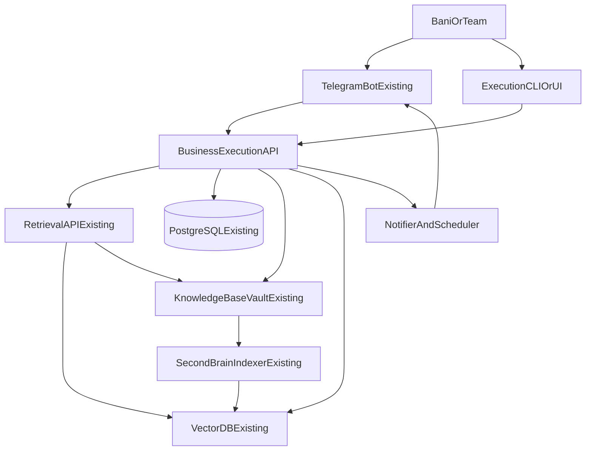

# Business Productivity Blueprint Master v1

Blueprint ini mendefinisikan workspace kedua sebagai execution layer bisnis untuk Bani Risset, berjalan di VPS yang sama, berbagi knowledge base yang sama, tanpa mengubah sistem SecondBrain yang sudah ada.

## 1. Ringkasan

Workspace kedua berfungsi sebagai mesin eksekusi output bisnis aktif:

- brutal funnel orchestration,
- daily content factory lintas channel,
- proposal dan deliverable generator,
- revenue/pipeline tracker,
- personal brand execution.

Posisi terhadap SecondBrain:

- SecondBrain = knowledge layer (capture, canonical knowledge, indexing, retrieval + citation).
- Workspace kedua = execution layer (planning, drafting, distribution, tracking).
- Semua drafting wajib memakai Retrieval API existing.

## 2. Diagram Arsitektur



## 3. Komponen Baru

| Komponen | Fungsi | Depends on |
|---|---|---|
| BusinessExecutionAPI | Orkestrasi modul bisnis end-to-end | Retrieval API, PostgreSQL, vault |
| FunnelPlannerEngine | Analisis gap funnel dan prioritas harian | PostgreSQL, Retrieval API |
| DailyContentFactory | Batch konten harian lintas funnel/channel | Retrieval API, vault, PostgreSQL |
| DistributionTracker | Tracking publish dan sinyal performa awal | PostgreSQL, Telegram bot |
| ProposalDeliverableEngine | Generate proposal/SOW/training outline | Retrieval API, vault |
| RevenuePipelineEngine | Deal pipeline dan invoice tracking | PostgreSQL, Telegram bot |
| TelegramCommandExtension | Tambah command bisnis tanpa ganggu command lama | Telegram bot existing |
| GovernanceAuditLayer | Audit trail, reconciliation, rollback, incident control | PostgreSQL, vault |

## 4. Data Model Tambahan (PostgreSQL)

Gunakan schema `biz` pada instance PostgreSQL existing.

```sql
create schema if not exists biz;

create table if not exists biz.client_account (
  id uuid primary key,
  name text not null,
  segment text,
  region text,
  owner text,
  people_note_id uuid null references knowledge_note(id),
  created_at timestamptz not null default now(),
  updated_at timestamptz not null default now()
);

create table if not exists biz.project_tracker (
  id uuid primary key,
  client_id uuid not null references biz.client_account(id),
  project_name text not null,
  status text not null,
  priority text,
  project_note_id uuid null references knowledge_note(id),
  source_capture_id uuid null references raw_capture(id),
  created_at timestamptz not null default now(),
  updated_at timestamptz not null default now()
);

create table if not exists biz.funnel_stage_map (
  id uuid primary key,
  stage text not null,
  objective text not null,
  primary_kpi text not null,
  secondary_kpi text,
  active boolean not null default true,
  created_at timestamptz not null default now(),
  updated_at timestamptz not null default now()
);

create table if not exists biz.channel_pool (
  id uuid primary key,
  channel_name text not null,
  cadence_target text not null,
  stage_focus text not null,
  owner text,
  active boolean not null default true,
  created_at timestamptz not null default now(),
  updated_at timestamptz not null default now()
);

create table if not exists biz.daily_content_queue (
  id uuid primary key,
  content_date date not null,
  title text not null,
  topic text not null,
  funnel_stage text not null,
  channel_id uuid not null references biz.channel_pool(id),
  format text not null,
  status text not null,
  draft_note_id uuid null references knowledge_note(id),
  source_capture_id uuid null references raw_capture(id),
  idempotency_key text not null unique,
  created_at timestamptz not null default now(),
  updated_at timestamptz not null default now()
);

create table if not exists biz.distribution_log (
  id uuid primary key,
  content_queue_id uuid not null references biz.daily_content_queue(id),
  channel_name text not null,
  distributed_at timestamptz,
  distribution_status text not null,
  early_signal_json jsonb,
  created_at timestamptz not null default now(),
  updated_at timestamptz not null default now()
);

create table if not exists biz.deliverable_item (
  id uuid primary key,
  deliverable_type text not null,
  client_id uuid null references biz.client_account(id),
  title text not null,
  status text not null,
  source_note_id uuid null references knowledge_note(id),
  output_note_id uuid null references knowledge_note(id),
  created_at timestamptz not null default now(),
  updated_at timestamptz not null default now()
);

create table if not exists biz.deal_pipeline (
  id uuid primary key,
  lead_name text not null,
  org_name text,
  stage text not null,
  estimated_value numeric(18,2),
  currency text default 'IDR',
  expected_close_date date,
  related_note_id uuid null references knowledge_note(id),
  source_capture_id uuid null references raw_capture(id),
  created_at timestamptz not null default now(),
  updated_at timestamptz not null default now()
);

create table if not exists biz.invoice_tracker (
  id uuid primary key,
  deal_id uuid null references biz.deal_pipeline(id),
  invoice_number text,
  amount numeric(18,2) not null,
  status text not null,
  issued_at date,
  due_at date,
  paid_at date,
  created_at timestamptz not null default now(),
  updated_at timestamptz not null default now()
);

create table if not exists biz.content_to_revenue_link (
  id uuid primary key,
  content_queue_id uuid not null references biz.daily_content_queue(id),
  deal_id uuid null references biz.deal_pipeline(id),
  link_type text not null,
  evidence_note_id uuid null references knowledge_note(id),
  created_at timestamptz not null default now()
);

create table if not exists biz.execution_sla_log (
  id uuid primary key,
  sla_name text not null,
  sla_date date not null,
  status text not null,
  reason text,
  created_at timestamptz not null default now()
);

create table if not exists biz.execution_audit_log (
  id uuid primary key,
  task_id text not null,
  command_name text not null,
  owner_platform text not null,
  input_ref text,
  output_path text,
  status text not null,
  reviewer text,
  created_at timestamptz not null default now()
);
```

## 5. Folder Tambahan di Vault

Tambahan folder baru pada root `knowledge-base`:

- `knowledge-base/content`
- `knowledge-base/content/personal-brand`
- `knowledge-base/deliverables`
- `knowledge-base/pipeline`
- `knowledge-base/pipeline/weekly`
- `knowledge-base/pipeline/monthly`
- `knowledge-base/pipeline/audit`
- `knowledge-base/templates/business`

## 6. Workflow Detail per Modul

### A. Client & Project Management
- Input: update klien/proyek via command atau UI.
- Process: update `biz.client_account` dan `biz.project_tracker`, link ke note `people`/`projects`.
- Output: status proyek + snapshot markdown pipeline.

### B. Content & Campaign Execution
- Input: brief harian, ide dari `inbox`/`notes`, target stage.
- Process: `funnel_gap` -> retrieval -> draft -> review -> schedule -> publish.
- Output: konten lintas channel, status lifecycle lengkap.

### C. Proposal & Deliverable Generator
- Input: objective client dan tipe deliverable.
- Process: retrieval dari `notes/references/decisions` + template business.
- Output: proposal/SOW/training outline di `deliverables`.

### D. Revenue & Pipeline Tracker
- Input: update deal/invoice.
- Process: update stage pipeline + trigger reminder.
- Output: report pipeline, alert due invoice, linkage ke konten.

### E. Personal Brand Layer
- Input: ide artikel/video/speaking dari `inbox` dan `notes`.
- Process: retrieval-grounded drafting + scheduling.
- Output: backlog terstruktur dan draft publish-ready.

## 7. Telegram Command Baru

- `/daily_batch [date] [focus_stage]`
- `/funnel_gap [period]`
- `/content_draft [topic] [channel] [stage]`
- `/publish_queue [date]`
- `/proposal_gen [client] [type] [objective]`
- `/client_add [name] [segment] [region]`
- `/project_update [project] [status] [next_action]`
- `/deal_add [lead] [org] [value] [stage]`
- `/deal_stage [deal_id] [stage]`
- `/invoice_update [invoice_number] [status]`
- `/pipeline_report [period]`
- `/brand_idea [topic] [angle]`
- `/sla_status [date]`

## 8. Integration Points

- BusinessExecutionAPI -> Retrieval API existing (mandatory).
- Jalur model resmi: `BusinessExecutionAPI -> Retrieval API existing -> Ollama Cloud API`.
- Schema `biz` di PostgreSQL existing dengan FK ke `knowledge_note/raw_capture`.
- Read/write ke vault shared Obsidian lokal (tidak ada vault kedua).
- Sinkronisasi vault Obsidian lokal <-> VPS wajib terjadwal dan terverifikasi checksum/count harian.
- Vector DB shared (opsional namespace/metadata filter `domain=business`).
- Telegram bot shared (hanya extend command map).

## 8.1 Reliability Contract (Mandatory)

- Timeout standar:
  - Retrieval API call: 10 detik.
  - Ollama Cloud call via Retrieval API: 30 detik.
- Retry policy:
  - max 2 retry, exponential backoff (1 detik, 3 detik).
  - hanya untuk error transient (5xx, timeout, network reset).
- Circuit breaker:
  - buka jika 5 kegagalan beruntun dalam 60 detik.
  - durasi open state 120 detik, lalu half-open dengan 1 request probe.
- Degrade mode:
  - jika retrieval/model unavailable, return `context_not_sufficient`.
  - dilarang generate jawaban tanpa evidence.
- No new LLM path:
  - semua drafting tetap melewati Retrieval API existing.

## 8.2 Capacity & Throughput Guardrail (Shared VPS)

- Concurrency limit global business workflows: maksimal 4 job paralel.
- High-risk draft job: maksimal 1 job paralel (wajib review gate).
- Queue pressure control:
  - queue > 40 item: throttle batch 50%.
  - queue > 80 item: freeze non-critical command (`/brand_idea`, batch non-conversion).
- Prioritas saat resource sempit:
  1. Conversion
  2. Invoice/deal updates
  3. Consideration
  4. Awareness
  5. Expansion
- Wajib expose metric minimum: queue depth, failed job ratio, avg processing latency.

## 8.3 Cost & Rate Guardrail (Ollama Cloud)

- Budget harian token/API cost ditetapkan per modul (content, proposal, pipeline).
- Alert threshold:
  - 70%: warning + optimasi prompt context window.
  - 85%: throttle non-critical generation.
  - 100%: stop non-critical run, hanya critical ops.
- Rate limit guard:
  - request burst dibatasi scheduler; gunakan jitter untuk batch start.
- Semua pelanggaran threshold harus dicatat ke `biz.execution_audit_log` + laporan harian.

## 9. Fase Implementasi

1. Schema `biz` + index + FK + folder vault + template.
2. Validasi retrieval read-path dan metadata filter.
3. Aktivasi DailyContentFactory.
4. Aktivasi Brutal Funnel Ops.
5. Aktivasi ProposalDeliverableEngine.
6. Aktivasi RevenuePipelineEngine + notifier.
7. Hardening: audit, reconciliation, rollback, incident drill.

## 10. Risiko dan Mitigasi

| Risiko | Dampak | Mitigasi |
|---|---|---|
| Kontaminasi konteks lintas domain | Output salah konteks | metadata filter ketat |
| Vault penuh noise | Retrieval menurun | template disiplin + lint berkala |
| DB-vault drift | Audit sulit | reconciliation harian |
| Command collision bot | Ganggu operasi lama | versioned route map + rollback command |
| Over-automation | Quality turun | review gate by risk tier |

## 11. OpenClaw-Hermes Orchestration

### 11.1 Capability Routing Matrix

| Task Type | Preferred Owner | Fallback | Review |
|---|---|---|---|
| Capture dan canonical note | OpenClaw | - | Sampling |
| Retrieval grounding + citation | OpenClaw | Hermes | Mandatory (client-facing) |
| Daily content batch | Hermes | OpenClaw | Mandatory (conversion) |
| Funnel gap detection | Hermes | OpenClaw | Optional |
| Proposal/SOW/training outline | OpenClaw | Hermes | Mandatory |
| Distribution tracking | Hermes | OpenClaw | Optional |
| Deal/invoice update | Hermes | OpenClaw | Optional |
| Command governance bot | OpenClaw | - | Mandatory |

### 11.2 Task Lifecycle

`Inbox -> Assigned -> In Progress -> Review -> Done | Failed`

### 11.3 Handoff Contract

Setiap handoff wajib memuat:

- what_done
- artifact_paths
- verification_steps
- known_risks
- next_action

## 12. Playbook Brutal Funnel Harian

### 12.1 Target Minimum Harian

- Awareness: 2 output
- Consideration: 1 output
- Conversion: 1 output
- Expansion: 1 output

Minimum total: 5 output/hari.

### 12.2 Ritme Harian

- 06:00-06:30 `funnel_gap`
- 06:30-07:30 `daily_batch`
- 07:30-08:30 review high-risk
- 09:00-10:00 lock publish queue
- 11:00-17:00 distribusi
- 20:00-22:00 signal review + queue besok

### 12.3 Prioritas Saat Kapasitas Terbatas

1. Conversion
2. Consideration
3. Awareness
4. Expansion

## 13. Weekly War Room

- Frekuensi: mingguan (Jumat), 90 menit.
- Output wajib:
  - `weekly-scorecard-YYYY-MM-DD.md`
  - `winner-loser-matrix-YYYY-MM-DD.md`
  - `next-week-plan-YYYY-MM-DD.md`
  - `risk-register-YYYY-MM-DD.md`

Decision framework:

- Scale: perform > target 2 minggu berturut.
- Fix: reach tinggi conversion rendah.
- Kill: perform rendah 3 minggu berturut.

## 14. Monthly Scale Protocol

- Frekuensi: bulanan, 120 menit.
- Fokus: offer packaging, segment-country priority, capacity guardrail, OKR bulan depan.
- Output wajib:
  - `monthly-scorecard-YYYY-MM.md`
  - `offer-performance-YYYY-MM.md`
  - `segment-country-priority-YYYY-MM.md`
  - `monthly-decisions-YYYY-MM.md`
  - `next-month-okr-YYYY-MM.md`

## 15. Governance & Audit Layer

### 15.1 Change Control

- Low risk: owner modul.
- Medium risk: owner + reviewer.
- High risk: orchestrator + reviewer + owner sistem.

### 15.2 Prompt Compliance

- retrieval-first
- citation required
- no hallucination
- fallback `context_not_sufficient`

### 15.3 Reconciliation

Rekonsiliasi harian:

- DB `biz.daily_content_queue` vs folder `knowledge-base/content`
- DB `biz.deliverable_item` vs folder `knowledge-base/deliverables`

### 15.4 Rollback Levels

1. workflow rollback
2. command rollback
3. schema rollback
4. operational freeze (read-only commands)

### 15.5 Incident Severity

- Class A: kritikal, freeze + rollback + report <= 60 menit.
- Class B: mayor, throttle + mandatory review.
- Class C: minor, context refill + continue.

## 16. KPI Master

- Routing accuracy
- SLA compliance harian
- Review compliance
- Handoff completeness
- Content-to-revenue linkage
- Pipeline velocity
- MTTD/MTTR incident
- Reconciliation success rate

## 17. Definition of Done Blueprint Master v1

Blueprint dianggap aktif penuh jika:

- schema `biz` aktif dan tervalidasi,
- command set bisnis berjalan tanpa mengganggu command lama,
- funnel harian berjalan sesuai SLA,
- weekly dan monthly review artifacts terbit konsisten,
- governance (audit, reconciliation, rollback, incident) aktif dan terukur,
- reliability contract (timeout/retry/circuit breaker/degrade mode) aktif,
- sync contract Obsidian lokal <-> VPS tervalidasi harian,
- capacity + cost guardrail berjalan dan terbukti di audit harian.

---

Dokumen ini adalah bundel master untuk eksekusi business productivity layer di atas SecondBrain existing, dengan prinsip strict separation: knowledge layer tetap stabil, execution layer bergerak cepat.
